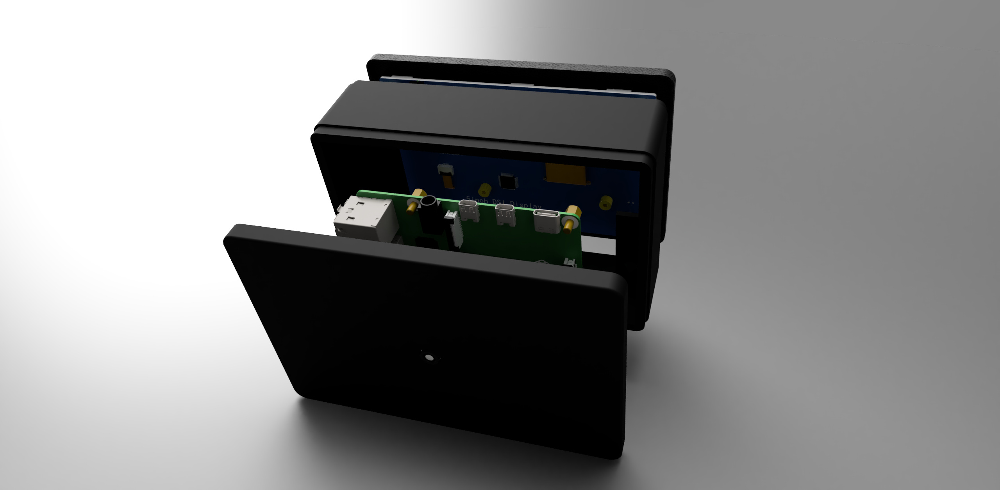
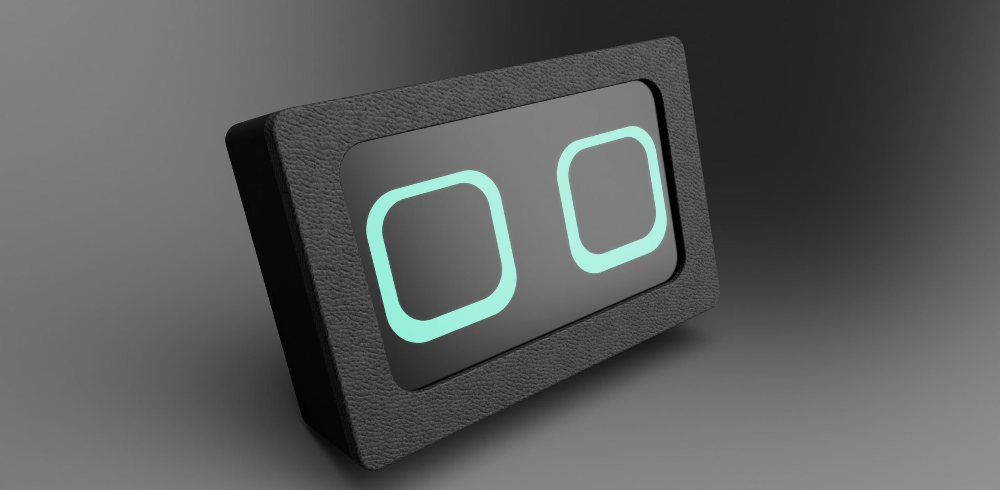
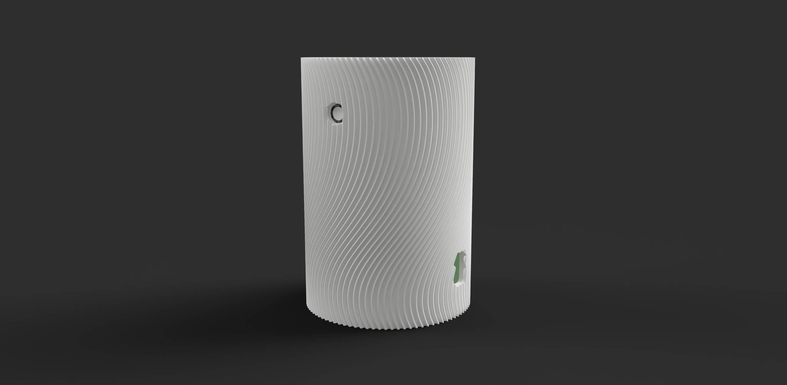
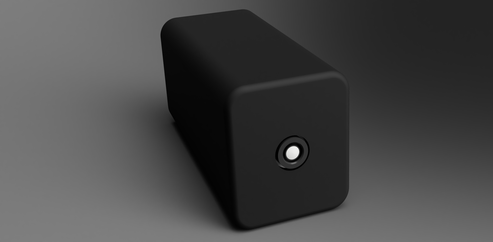

# OPX1: Smart Camera Platform

## Introduction

OPX1 is an open-source, easy-to-use smart camera platform that you can train for various applications, including:

- Pet monitoring
- Toddler supervision
- Fitness routine tracking
- Home automation

This README serves as a comprehensive guide to building and using the OPX1 platform.

## Hardware Options

### OPX1 Pro

Features:
- Raspberry Pi 5
- AI Kit
- AI Camera
- Mic
- Speaker
- Display

Price: $399

### OPX1 Home

Features:
- Raspberry Pi 5
- AI Kit
- Camera V2 with Mic and Speaker

Price: $299

### OPX1 Cam

Features:
- Lightweight live-inference camera module

Price: $149

**Availability**

Developer kits will start shipping in November 2024, and mass-manufactured consumer devices will be available in 2025.

## Building Your OPX1

**Note:** Pre-assembled options are available for purchase. For DIY enthusiasts, the following components are required:

1. **Gather Components**: 
   - Raspberry Pi 5
   - AI Camera module and/or AI kit
   - 3D-printed case (STL files provided in `/case` directory)
   - Power supply

2. **Assembly**:
   - Connect the camera module to the Raspberry Pi
   - Install the Raspberry Pi and camera into the 3D-printed case
   - Connect the power supply

3. **Software Setup**:
   - Flash the provided OPX1 OS image to an SD card
   - Insert the SD card into the Raspberry Pi and power on
   - Follow the on-screen instructions for initial setup

## Usage

1. Access the OPX1 web interface by navigating to `http://<OPX1-IP-ADDRESS>` in your browser
2. Use the interface to configure your device and set up monitoring rules
3. Train the AI model using the provided tools for your specific use case

## Applications

- **Pet Monitoring**: Train OPX1 to recognize your pets and alert you of unusual behavior
- **Toddler Supervision**: Set up safe zones and receive notifications if your child leaves designated areas
- **Fitness Tracking**: Use pose estimation to track your workout form and count repetitions
- **Home Automation**: Integrate with smart home devices to automate lighting, thermostats, and more based on camera input

## Future Expansions

We're constantly working on improving OPX1. Upcoming features include:

- Integrated support for Home Assistant home automation
- IFTTT (If This Then That) support for even more customization and automation possibilities
- Enhanced AI models for more accurate object detection and behavior analysis
- Cloud storage options for AI processing
- Additional sensors for environmental monitoring such as temperature, humidity, and air quality
- Better integration with existing smart home devices
- More support for B2B partners

## Resources

- [Official Website](https://opx.framer.website/)
- [Hardware Details](https://opx.framer.website/hardware)
- [Starting Point: Hailo-RPi5-Examples](https://github.com/hailo-ai/hailo-rpi5-examples) - This project has made use of some of the examples provided by Hailo for the Raspberry Pi 5.
- [Starting Point: RPiCam-Apps](https://github.com/raspberrypi/rpicam-apps) - This project has also been built upon some of the examples provided by Raspberry Pi for camera applications.

## Contributing

We welcome contributions! Please see our [Contributing Guidelines](CONTRIBUTING.md) for more information on how to get involved.

## License

This project is licensed under the MIT License - see the [LICENSE](LICENSE) file for details.
